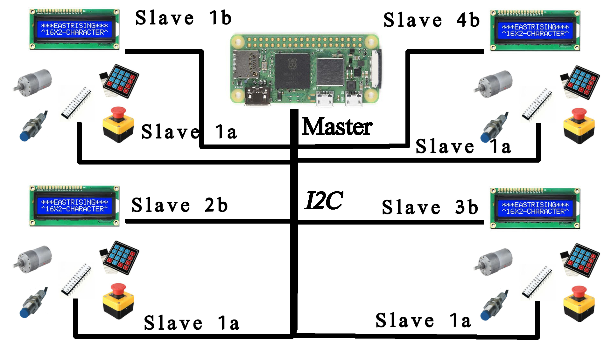

# Lazarus
Sistema de alimentacion de ganado para integracion en salas de ordeño en proceso de automatizacion.

## Índice

1. [Introducción](#1-introducción)
    - [Descripción del Proyecto](#11-descripción-del-proyecto)
    - [Objetivos](#12-objetivos)
    - [Alcance](#13-alcance)
2. [Requisitos del Sistema](#2-requisitos-del-sistema)
    - [Requisitos de Hardware](#21-requisitos-de-hardware)
    - [Requisitos de Software](#22-requisitos-de-software)
    - [Especificaciones Técnicas](#23-especificaciones-técnicas)
3. [Diseño del Sistema](#3-diseño-del-sistema)
    - [Arquitectura del Sistema](#31-arquitectura-del-sistema)
    - [Diagramas de Componentes](#32-diagramas-de-componentes)
        - [Diagrama Esquemático General](#321-diagrama-esquemático-general)
        - [Conexiones de Hardware](#322-conexiones-de-hardware)
4. [Configuración del Hardware](#4-configuración-del-hardware)
    - [Raspberry Pi Zero 2W](#41-raspberry-pi-zero-2w)
        - [Configuración Inicial](#411-configuración-inicial)
        - [Conexiones I2C](#412-conexiones-i2c)
    - [ATmega 328](#42-atmega-328)
        - [Pantalla 16x2](#421-pantalla-16x2)
        - [Teclado 4x4](#422-teclado-4x4)
        - [Actuador](#423-actuador)
        - [Sensor de Inducción](#424-sensor-de-inducción)
        - [Botón de Parada de Emergencia](#425-botón-de-parada-de-emergencia)
5. [Desarrollo del Software](#5-desarrollo-del-software)
    - [Configuración del Entorno de Desarrollo](#51-configuración-del-entorno-de-desarrollo)
        - [Instalación de Herramientas en Ubuntu](#511-instalación-de-herramientas-en-ubuntu)
    - [Programación de la Raspberry Pi](#52-programación-de-la-raspberry-pi)
        - [Comunicación I2C con ATmega 328](#521-comunicación-i2c-con-atmega-328)
    - [Programación del ATmega 328](#53-programación-del-atmega-328)
        - [Código del Maestro (Raspberry Pi)](#531-código-del-maestro-raspberry-pi)
        - [Código de los Esclavos (ATmega 328)](#532-código-de-los-esclavos-atmega-328)
            - [Pantalla 16x2](#5321-pantalla-16x2)
            - [Teclado 4x4](#5322-teclado-4x4)
            - [Actuador](#5323-actuador)
            - [Sensor de Inducción](#5324-sensor-de-inducción)
            - [Botón de Parada de Emergencia](#5325-botón-de-parada-de-emergencia)
6. [Integración y Pruebas](#6-integración-y-pruebas)
    - [Integración del Sistema](#61-integración-del-sistema)
    - [Pruebas de Hardware](#62-pruebas-de-hardware)
    - [Pruebas de Software](#63-pruebas-de-software)
    - [Validación del Sistema](#64-validación-del-sistema)
7. [Implementación](#7-implementación)
    - [Despliegue del Sistema](#71-despliegue-del-sistema)
    - [Documentación del Usuario](#72-documentación-del-usuario)
        - [Manual del Usuario](#721-manual-del-usuario)
        - [Solución de Problemas Comunes](#722-solución-de-problemas-comunes)
8. [Mantenimiento](#8-mantenimiento)
    - [Plan de Mantenimiento](#81-plan-de-mantenimiento)
    - [Actualizaciones de Software](#82-actualizaciones-de-software)
9. [Anexos](#9-anexos)
    - [Esquemas Detallados](#91-esquemas-detallados)
    - [Códigos Fuente](#92-códigos-fuente)
    - [Referencias](#93-referencias)

## 1. Introducción
LAZARUS es un proyecto de desarroyo de hardware para la implementacion de un sistema de alimentacion de ganado. 
 El sistema esta pensado para satisfacer la necesidad de automatizacion de registros de un negocio de lecheria que inicia con el proceso de automatizacion con orientacion a certificacion y optimizacion en los proceso de produccion.
 En este repositorio LAZARUS presenta su primera version de software estable.

### 1.1. Descripción del Proyecto

LAZARUS implementa un sistema de automatizacion de alimentacion de ganado lechero.

### 1.2. Objetivos

Dotar al pequeño y mediano productor de leche con un mecanismo que le permite la facil implementacion de sistemas de gestion de la calidad en su proyecto lechero, con orientacion a la cerficicaion de su negocio en este aspecto de los sistemas de gestion.

Desarrollar un sistema modular que permita al cliente implementar el proyecto de manera gradual, avanzando desde un estado inicial sin tecnificación hacia una automatización total. Este enfoque está diseñado para crear un ecosistema integral que fortalezca la vinculación entre el cliente y la empresa, fomentando la lealtad y optimizando la experiencia del cliente

### 1.3. Alcance

#### 1.3.1 Conectividad y Acceso
- El sistema puede conectarse a una red Wi-Fi especificada por el usuario. (Para probeer de un metodo no invasivo de acceso al sistema guardando el indice de proteccion de sellado)
- El sistema puede exponer su servicio a un DNS privado para ser encontrado por el usuario como LAZARUS.LOCAL en su navegador de internet. (va en liea del objetivo de modularizacion)

#### 1.3.2 Gestión de Usuarios
- El sistema permite ingresar a un usuario con el rol de administrador únicamente mediante el uso de su correo y contraseña registrados en la aplicación mediante su dispositivo de trabajo, o un pin en el teclado (sistemas de gestion, responsabilidad de las acciones)
- El sistema permite ingresar a un colaborador mediante el uso de su correo y contraseña en su dispositivo de trabajo, o un pin en el teclado. (revela que hay diferentes roles en el sistema, una vez mas orientado a la implementacion de sistemas de gestion mediante el control de responsabilidades y accesos.)
- El usuario administrador puede crear usuarios colaboradores. (caracteristica de adminsitracion, hay que definir que cosas puede hacer cada quien)

#### 1.3.3 Gestión de Ganado
- El usuario administrador puede registrar animales nuevos y dar de baja a animales del registro. (es importante tener en cuenta que el registro debe permanecer, solo ocambia el estado)
- El usuario administrador puede descargar los registros en formato Excel a su computadora o celular. (objetivo fundamental del PMV)
- El usuario administrador puede modificar el factor de cantidad de concentrado de una cabeza de ganado usando su dispositivo de trabajo o su pin y el teclado. (Este es un cambio en la configuracion general del sistema, el colaborador puede hacer una alteracion a una alimentacion, pero no a este registro)

- El usuario Administrador tiene todas capacidades del usuario colaborador.

- El usuario Colaborador puede ordenar la alimentación de una cabeza específica de ganado mediante el uso del teclado o el dispositivo de trabajo.
- El usuario trabajador puede configurar la cantidad de concentrado dispensado de una cabeza específica de ganado usando el teclado del dispositivo o su dispositivo de trabajo.( Solo para la ocacion especifica, se gurada el registro de la accion pero no ser repite.)
- El usuario trabajador puede solicitar adiciones a la dispensación de alimento para una cabeza de ganado específica, usando el teclado o el dispositivo de trabajo. (esta accion se lleva a cavo una sola vez, y se registra para asignar responsabilidad al operario)
- El usuario trabajador puede ingresar el registro de producción de una vaca mediante el teclado o dispositivo de trabajo. (este desarroyo debe estar orientado a la iplementacion de sensores automaticos existentes en el mercado)
- El usuario trabajador puede ingresar un registro de historial médico mediante el uso de su dispositivo de trabajo. (tomar una foto del documento entregado por el veterinario, DEJAR PARA UN DESARROYO POSTERIOR)
- El usuario trabajador puede ingresar un registro de estado (peso, preñez, partos, retiros) mediante el uso de su dispositivo de trabajo. (DEJAR PARA UN DESARROYO POSTERIOR)

#### 1.3.4 Funcionalidades del Sistema
- El sistema registra el tiempo de permanencia de una vaca en el comedero. ( ESTE TIEMPO ES DECIDIDO POR EL SENSOR DE FLUJO, O POR UN INDICE RELACIONADO A LA CANTIDAD DISPENSADA)
- El sistema lanza alertas de vaca en retiro, o orden de aplicación de medicamento, toma de peso, o palpación en el momento de ingreso del animal al comedero. (DESARROYO POSTERIOR)
- El sistema puede sugerir un orden de ordeño, dejando a las vacas con necesidades especiales de cuidado para el final del ordeño. (DESARROYO POSTERIOR)
- El sistema lanza alertas de servicio de inseminación y sincronización en el momento de ingreso del animal. (POSTERIOR)

## 2. Requisitos del Sistema
### 2.1. Requisitos de Hardware
### 2.2. Requisitos de Software
### 2.3. Especificaciones Técnicas

## 3. Diseño del Sistema
### 3.1. Arquitectura del Sistema
### 3.2. Diagramas de Componentes
#### 3.2.1. Diagrama Esquemático General
La representacion esquematica del hardware de este proyecto se ve en la siguiente imagen:

#### 3.2.2. Conexiones de Hardware

## 4. Configuración del Hardware
### 4.1. Raspberry Pi Zero 2W
#### 4.1.1. Configuración Inicial
#### 4.1.2. Conexiones I2C
### 4.2. ATmega 328
#### 4.2.1. Pantalla 16x2
#### 4.2.2. Teclado 4x4
#### 4.2.3. Actuador
#### 4.2.4. Sensor de Inducción
#### 4.2.5. Botón de Parada de Emergencia

## 5. Desarrollo del Software
### 5.1. Configuración del Entorno de Desarrollo
#### 5.1.1. Instalación de Herramientas en Ubuntu
### 5.2. Programación de la Raspberry Pi
#### 5.2.1. Comunicación I2C con ATmega 328
### 5.3. Programación del ATmega 328
#### 5.3.1. Código del Maestro (Raspberry Pi)
#### 5.3.2. Código de los Esclavos (ATmega 328)
##### 5.3.2.1. Pantalla 16x2
##### 5.3.2.2. Teclado 4x4
##### 5.3.2.3. Actuador
##### 5.3.2.4. Sensor de Inducción
##### 5.3.2.5. Botón de Parada de Emergencia

## 6. Integración y Pruebas
### 6.1. Integración del Sistema
### 6.2. Pruebas de Hardware
### 6.3. Pruebas de Software
### 6.4. Validación del Sistema

## 7. Implementación
### 7.1. Despliegue del Sistema
### 7.2. Documentación del Usuario
#### 7.2.1. Manual del Usuario
#### 7.2.2. Solución de Problemas Comunes

## 8. Mantenimiento
### 8.1. Plan de Mantenimiento
### 8.2. Actualizaciones de Software

## 9. Anexos
### 9.1. Esquemas Detallados
### 9.2. Códigos Fuente
### 9.3. Referencias
